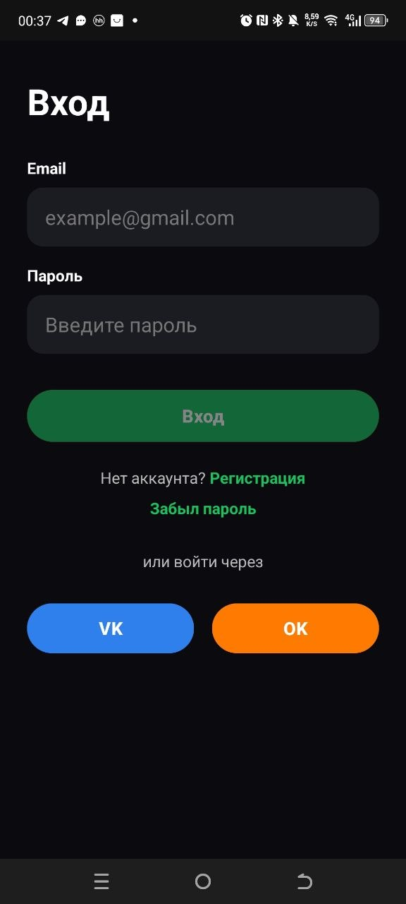
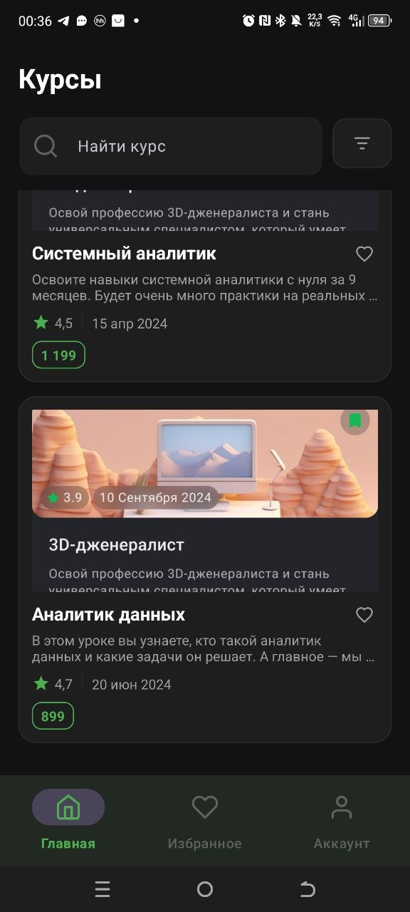
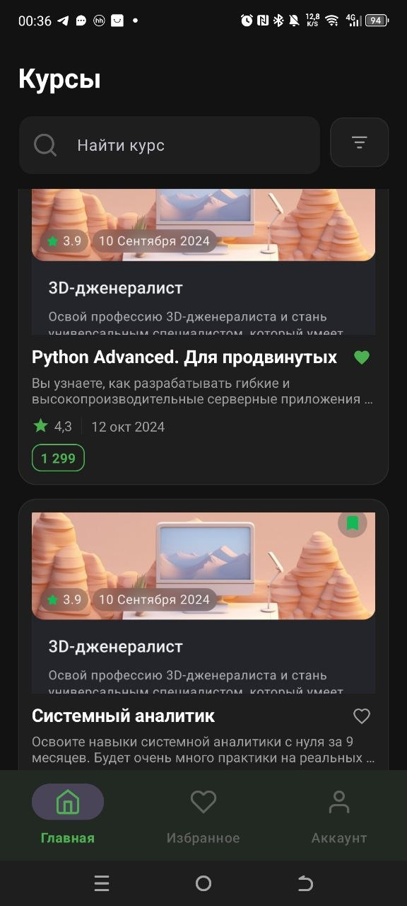
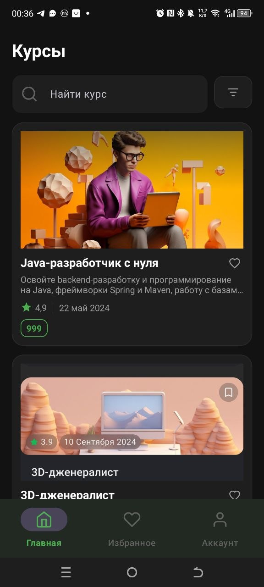

# CoursesApp

Мобильное Android-приложение для просмотра онлайн-курсов.  
Проект написан на Kotlin с использованием XML, RecyclerView, Navigation Component и архитектуры MVVM.

---

## Возможности приложения

- Авторизация пользователя
- Просмотр списка курсов
- Добавление курсов в избранное
- Bottom Navigation
- Поиск курсов
- Темная тема интерфейса
- Работа с RecyclerView
- Навигация между экранами

---

# Скриншоты приложения

## Экран авторизации



---

## Главный экран



---

## Экран избранного



---

## Список курсов



---

# Стек технологий

- Kotlin
- XML
- MVVM
- RecyclerView
- ViewBinding
- Navigation Component
- Coroutines
- Flow
- Material Design

---

# Структура проекта

```text
presentation/
 ├── account
 ├── adapter
 ├── favorites
 ├── home
 └── login

data/
domain/
```

---

# Запуск проекта

1. Открыть проект в Android Studio
2. Дождаться Gradle Sync
3. Запустить эмулятор
4. Нажать Run ▶

---

# Сборка APK

```text
Build → Generate App Bundles or APKs → Build APKs
```

APK появится в папке:

```text
app/build/outputs/apk/debug/
```
